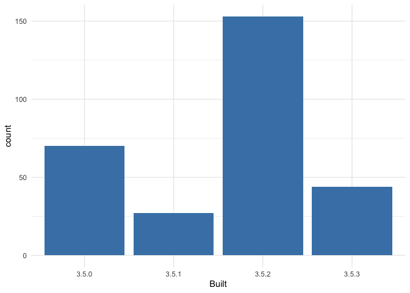
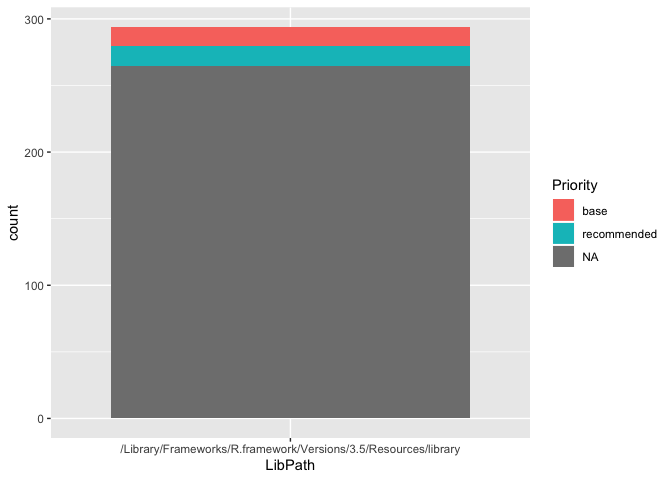

explore-libraries.R
================
saraharcos
2020-01-27

Which libraries does R search for
    packages?

``` r
.libPaths()
```

    ## [1] "/Library/Frameworks/R.framework/Versions/3.5/Resources/library"

``` r
.Library
```

    ## [1] "/Library/Frameworks/R.framework/Resources/library"

Installed
    packages

``` r
library(tidyverse)
```

    ## ── Attaching packages ───────────────────────────────────── tidyverse 1.3.0 ──

    ## ✓ ggplot2 3.2.1     ✓ purrr   0.3.3
    ## ✓ tibble  2.1.3     ✓ dplyr   0.8.3
    ## ✓ tidyr   1.0.0     ✓ stringr 1.4.0
    ## ✓ readr   1.3.1     ✓ forcats 0.4.0

    ## ── Conflicts ──────────────────────────────────────── tidyverse_conflicts() ──
    ## x dplyr::filter() masks stats::filter()
    ## x dplyr::lag()    masks stats::lag()

``` r
## use installed.packages() to get all installed packages
pg <- as_tibble(installed.packages())

## how many packages?
n_distinct(pg$Package)
```

    ## [1] 294

Exploring the packages

``` r
## count some things! inspiration
##   * tabulate by LibPath, Priority, or both
##   * what proportion need compilation?
##   * how break down re: version of R they were built on
print(paste("Number of LibPaths: ", n_distinct(pg$LibPath)))
```

    ## [1] "Number of LibPaths:  1"

``` r
pg %>% count(Priority)
```

    ## # A tibble: 3 x 2
    ##   Priority        n
    ##   <chr>       <int>
    ## 1 base           14
    ## 2 recommended    15
    ## 3 <NA>          265

``` r
needscomp <- pg %>% 
  count(NeedsCompilation) %>% 
  mutate(prop = n / sum(n)) %>%
  filter(NeedsCompilation == "yes") %>%
  pull(prop)

print(paste("Proportion of pckgs that need compilation: ", round(needscomp, 3)))
```

    ## [1] "Proportion of pckgs that need compilation:  0.466"

``` r
ggplot(pg, aes(x = Built)) +
  geom_bar(fill = "steelblue") +
  theme_minimal()
```

<!-- -->

Reflections

``` r
## reflect on ^^ and make a few notes to yourself; inspiration
##   * does the number of base + recommended packages make sense to you?
##   * how does the result of .libPaths() relate to the result of .Library?
pg %>%
  count(Priority)
```

    ## # A tibble: 3 x 2
    ##   Priority        n
    ##   <chr>       <int>
    ## 1 base           14
    ## 2 recommended    15
    ## 3 <NA>          265

``` r
ggplot(pg, aes(x = LibPath, fill = Priority)) +
  geom_bar()
```

<!-- -->

``` r
#The result of .libPaths() is ____ from the result of .Library
```

Going further

``` r
## if you have time to do more ...

## is every package in .Library either base or recommended?
## study package naming style (all lower case, contains '.', etc
## use `fields` argument to installed.packages() to get more info and use it!

#Not every package is base or recommended, the others are labelled as "NA"
```
